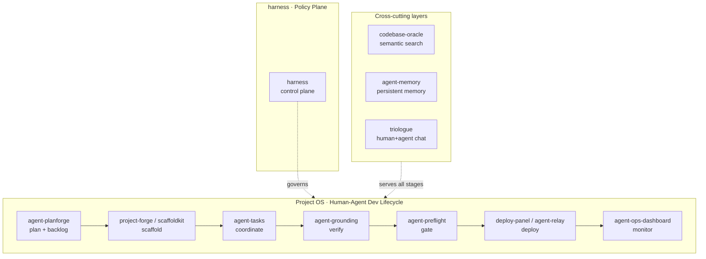

<h2 align="center">Hey, I'm Lan</h2>

Software Architect · Agentic AI Infrastructure · GovTech · Open Source

 <a href="https://lan-nguyen-si.de">Website</a> ·
 <a href="https://www.linkedin.com/in/lan-nguyen-si/">LinkedIn</a>

I architect GovTech platforms at **publicplan**. In parallel I build an open-source ecosystem that lets AI agents plan, build, validate, deploy, and monitor software alongside humans, focused on trustworthy autonomy through claim gates, grounding, and human-in-the-loop patterns.

**New here?** The quickest thing to grasp is **[depsight](https://github.com/LanNguyenSi/depsight)**: a CVE, license, and dependency-health dashboard with a **Dev Login** (no setup, no credentials) at **[depsight.opentriologue.ai](https://depsight.opentriologue.ai)**. The most mature module is **[agent-tasks](https://github.com/LanNguyenSi/agent-tasks)**: enforced workflows for humans and AI agents. The map below shows how it all fits together.

## Architecture

Most repos here are modules of one **Project OS**: a single pipeline that carries software from idea to production with AI agents in the loop. Each module also runs standalone. [Triologue](https://github.com/LanNguyenSi/triologue), the human-and-agent chat workspace, is a separate product line; `opentriologue.ai` is the shared hosted demo.

<b>The full ecosystem: every repo, grouped</b>

 

**Project OS · Human-Agent Dev Lifecycle**, the pipeline above, module by module:

| Module | What it does | Live |
|--------|-------------|------|
| [agent-planforge](https://github.com/LanNguyenSi/agent-planforge) | Architecture planning + backlog generation | via [project-forge](https://project-forge.opentriologue.ai) |
| [project-forge](https://github.com/LanNguyenSi/project-forge) | Project scaffolding from a description | [project-forge.opentriologue.ai](https://project-forge.opentriologue.ai) |
| [scaffoldkit](https://github.com/LanNguyenSi/scaffoldkit) | Declarative blueprint engine behind project-forge | via [project-forge](https://project-forge.opentriologue.ai) |
| [agent-tasks](https://github.com/LanNguyenSi/agent-tasks) | Task workflow for humans + agents, with claim gates and audit | [agent-tasks.opentriologue.ai](https://agent-tasks.opentriologue.ai) |
| [agent-grounding](https://github.com/LanNguyenSi/agent-grounding) | Stops agents acting on assumptions: claim gates, evidence ledger, runtime checks | |
| [agent-preflight](https://github.com/LanNguyenSi/agent-preflight) | Pre-push validation gate | |
| [deploy-panel](https://github.com/LanNguyenSi/deploy-panel) | Deployment control with API, MCP, and a GitHub Action | [deploy-panel.opentriologue.ai](https://deploy-panel.opentriologue.ai) |
| [agent-relay](https://github.com/LanNguyenSi/agent-relay) | Controlled execution on VPS targets | via [deploy-panel](https://deploy-panel.opentriologue.ai) |
| [agent-ops-dashboard](https://github.com/LanNguyenSi/agent-ops-dashboard) | Agent-fleet + repo health monitoring | [ops.opentriologue.ai](https://ops.opentriologue.ai) |
| [harness](https://github.com/LanNguyenSi/harness) | Declarative control plane: one YAML for grounding/tools/memory/hooks/policies | |

**Supporting libraries**

| Library | What it does |
|---------|--------------|
| [codebase-oracle](https://github.com/LanNguyenSi/codebase-oracle) | Local-first MCP server for semantic search across all your repos |
| [agent-memory](https://github.com/LanNguyenSi/agent-memory) | Sync, weave, and digest agent memory across sessions and machines |
| [agent-dx](https://github.com/LanNguyenSi/agent-dx) | Playbooks + tooling: slop-detector, release prep, GitHub CLI, batch git ops |
| [repo-intelligence](https://github.com/LanNguyenSi/repo-intelligence) | CI insights, repo-health scoring, perf-drift (depsight is its standalone flagship) |

## Standalone products

- **[depsight](https://github.com/LanNguyenSi/depsight)**: dependency health, CVE tracking, license + security scoring · [live](https://depsight.opentriologue.ai)
- **[triologue](https://github.com/LanNguyenSi/triologue)**: chat workspace where humans and AI agents collaborate as a team · [opentriologue.ai](https://opentriologue.ai)
- **[telerithm](https://github.com/LanNguyenSi/telerithm)**: AI-powered log analytics for self-hosted teams
- **[clawd-monitor](https://github.com/LanNguyenSi/clawd-monitor)**: monitoring dashboard for OpenClaw

## Stack

TypeScript · Next.js · Hono · Node.js · PostgreSQL · Prisma · Docker · Traefik · Symfony

---

*Architecting trustworthy AI agents, in public.*
