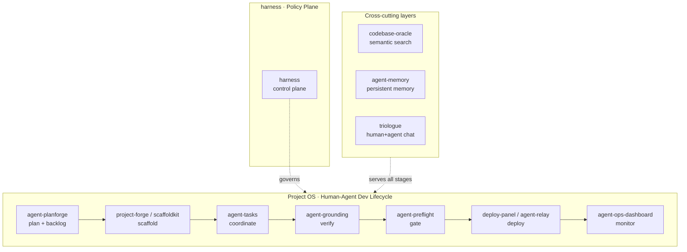

<h2 align="center">Hey, I'm Lan</h2>

Software Architect · Agentic AI Infrastructure · GovTech · Open Source

 <a href="https://lan-nguyen-si.de">Website</a> ·
 <a href="https://www.linkedin.com/in/lan-nguyen-si/">LinkedIn</a>

I architect GovTech platforms at **publicplan**. In parallel I build an open-source ecosystem that lets AI agents plan, build, validate, deploy, and monitor software alongside humans, focused on trustworthy autonomy through claim gates, grounding, and human-in-the-loop patterns.

## Architecture

The ecosystem covers the full human-agent software lifecycle, from planning to production.

## Start here

Pick the entry point that matches what you want to do. Every repo's own README has the setup details.

| If you want to… | Start with | Live |
|---|---|---|
| Run AI agents on tasks with audit trail | [agent-tasks](https://github.com/LanNguyenSi/agent-tasks) + [agent-tasks-cli](https://github.com/LanNguyenSi/agent-tasks/tree/master/cli) | [agent-tasks.opentriologue.ai](https://agent-tasks.opentriologue.ai) |
| Track CVEs, licenses, dep health across repos | [depsight](https://github.com/LanNguyenSi/depsight) | [depsight.opentriologue.ai](https://depsight.opentriologue.ai) |
| Deploy AI-managed services on a VPS | [deploy-panel](https://github.com/LanNguyenSi/deploy-panel) + [agent-relay](https://github.com/LanNguyenSi/agent-relay) | [deploy-panel.opentriologue.ai](https://deploy-panel.opentriologue.ai) |
| Search local repos semantically (MCP) | [codebase-oracle](https://github.com/LanNguyenSi/codebase-oracle) | |
| Stop AI agents from acting on assumptions | [agent-grounding](https://github.com/LanNguyenSi/agent-grounding) | |
| Declare what your agent is allowed to do | [harness](https://github.com/LanNguyenSi/harness) | |
| Bootstrap a new agent project | [project-forge](https://github.com/LanNguyenSi/project-forge) + [scaffoldkit](https://github.com/LanNguyenSi/scaffoldkit) | [project-forge.opentriologue.ai](https://project-forge.opentriologue.ai) |
| Persist AI memory across sessions | [agent-memory](https://github.com/LanNguyenSi/agent-memory) | |
| Monitor an agent fleet's health | [agent-ops-dashboard](https://github.com/LanNguyenSi/agent-ops-dashboard) | [ops.opentriologue.ai](https://ops.opentriologue.ai) |
| Run a chat workspace where humans and AI agents collaborate as a team | [triologue](https://github.com/LanNguyenSi/triologue) | [opentriologue.ai](https://opentriologue.ai) |

## Names you'll see, briefly

- **Project OS**: umbrella name for the lifecycle modules above (agent-tasks, deploy-panel, project-forge, etc.). They compose, but every module also runs standalone.
- **Triologue**: separate product line. A chat workspace where humans and AI agents collaborate as a team (shared rooms, project tasks both can claim, OAuth integrations, audit trail). Runs at [opentriologue.ai](https://opentriologue.ai). Public OSS since 2026-05-06.
- **opentriologue.ai**: the hosted demo subdomain. The same modules also self-host via Docker.

## All product lines

### Project OS · Human-Agent Dev Lifecycle

The full pipeline from idea to production, built for teams that work with AI agents.

| Module | What it does | Live |
|--------|-------------|------|
| [agent-tasks](https://github.com/LanNguyenSi/agent-tasks) | Task workflow for humans + agents | [agent-tasks.opentriologue.ai](https://agent-tasks.opentriologue.ai) |
| [deploy-panel](https://github.com/LanNguyenSi/deploy-panel) | Deployment management with API, MCP, GitHub Action | [deploy-panel.opentriologue.ai](https://deploy-panel.opentriologue.ai) |
| [agent-relay](https://github.com/LanNguyenSi/agent-relay) | Controlled execution on VPS targets | via [deploy-panel](https://deploy-panel.opentriologue.ai) |
| [agent-ops-dashboard](https://github.com/LanNguyenSi/agent-ops-dashboard) | Agent health monitoring | [ops.opentriologue.ai](https://ops.opentriologue.ai) |
| [project-forge](https://github.com/LanNguyenSi/project-forge) | Project scaffolding | [project-forge.opentriologue.ai](https://project-forge.opentriologue.ai) |
| [scaffoldkit](https://github.com/LanNguyenSi/scaffoldkit) | Declarative blueprint engine for project-forge | via [project-forge](https://project-forge.opentriologue.ai) |
| [agent-planforge](https://github.com/LanNguyenSi/agent-planforge) | Architecture planning + backlog generation | via [project-forge](https://project-forge.opentriologue.ai) |
| [harness](https://github.com/LanNguyenSi/harness) | Declarative control plane: one YAML for grounding/tools/memory/hooks/policies; PreToolUse hook denies tool calls without ledger evidence | |
| [agent-preflight](https://github.com/LanNguyenSi/agent-preflight) | Pre-push validation | |

### [Agent Grounding](https://github.com/LanNguyenSi/agent-grounding) · Verification & Debugging

Prevents agents from acting on assumptions. 8 packages for runtime checks, claim validation, evidence tracking, and guided debugging.

### [Codebase Oracle](https://github.com/LanNguyenSi/codebase-oracle) · Semantic Code Search

Local-first MCP server that semantically indexes your repos. Ask questions across all of them at once.

### [Repo Intelligence](https://github.com/LanNguyenSi/repo-intelligence) · CI & Repo Health

CI insights, repo health scoring, and performance drift detection. [depsight](https://github.com/LanNguyenSi/depsight) is the standalone flagship for dependency health and CVE tracking.

### [Agent Memory](https://github.com/LanNguyenSi/agent-memory) · Persistent Memory

Sync, weave, and digest agent memories across sessions and environments.

### [Agent DX](https://github.com/LanNguyenSi/agent-dx) · Developer Experience

Playbooks and tooling for teams building with AI agents. Includes slop-detector, scaffolds, release prep, a GitHub API CLI, and batch git ops.

## Standalone projects

- **[Telerithm](https://github.com/LanNguyenSi/telerithm)**: AI-powered log analytics for self-hosted teams
- **[Triologue](https://github.com/LanNguyenSi/triologue)**: chat workspace where humans and AI agents collaborate as a team, with shared rooms, project tasks, OAuth-connected context, and audit. Live at [opentriologue.ai](https://opentriologue.ai). AGPL v3, slow-pace development.
- **[Depsight](https://github.com/LanNguyenSi/depsight)**: dependency health dashboard, CVE tracking, security scoring
- **[Clawd Monitor](https://github.com/LanNguyenSi/clawd-monitor)**: monitoring dashboard for OpenClaw

## Stack

TypeScript · Next.js · Hono · Node.js · PostgreSQL · Prisma · Docker · Traefik · Symfony

---

*Architecting trustworthy AI agents, in public.*
